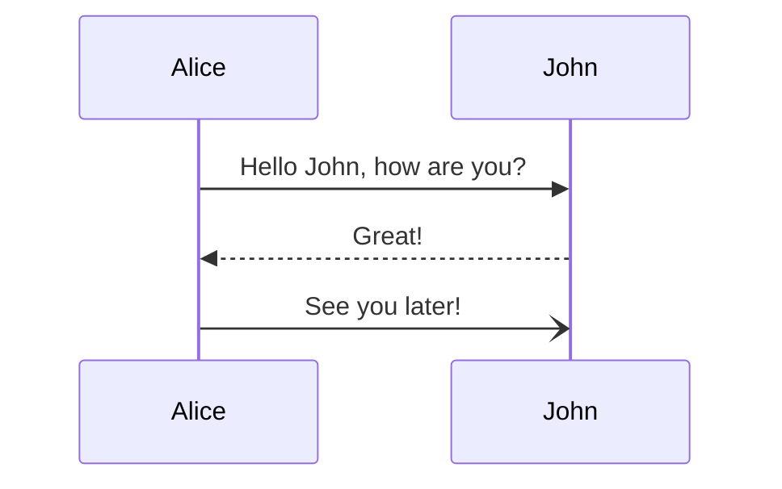

# MarkdownSlides

## Requirements for local builds

If you want to build the slides locally, Node or Docker is required.

### How to use it

Create one (README.md) or more markdown files in the root of your directory (e.g. a git repository) and start typing.

To start a new slide use a comment `<!-- slide -->`.

Example:

```markdown
# Lecture Title

@module[123456]
@semester[Summer 2022]

Korbinian Kuhn [kuhnko@](mailto:kuhnko@hdm-stuttgart.de)

<!-- slide -->

## Content

- What we will do
- What you will learn
```

Build the slides with:

```bash
sh master/build.sh
```

<!-- slide -->

## Example

<!-- slide -->

## Features

- First slide will be styled differently to provide a pretty title slide
- Slide numbers will be generated automatically
- You get a fancy mobile menu as a table of contents and to jump to specific slides
- Every code snippet will be highlighted automatically with highlight.js (during build time)
- Use space and arrow keys to navigate
- Slides are fully response for mobile devices and small screens
- You can even choose the dark mode in the side-nav
- Slides have a modified CSS-Stylesheet for print to generate a PDF with the browser
- Supports multiple markdown files to split your presentation in subslides (README.md will always be the entrypoint)
- Date of the build will be included as a versioning on the first slide and the table of contents
- Automatically create equations with MathJax and diagrams with Mermaid

<!-- slide -->

## Markdown extensions

<!-- slide -->

### Slides

| Identifier       | Description        |
| ---------------- | ------------------ |
| `<!-- slide -->` | Starts a new slide |

### Spacer

| Identifier         | Description                 |
| ------------------ | --------------------------- |
| `:spacer`          | Medium vertical spacer      |
| `:spacer{size=sm}` | Small vertical spacer       |
| `:spacer{size=md}` | Medium vertical spacer      |
| `:spacer{size=lg}` | Large vertical spacer       |
| `:spacer{size=xl}` | Extra-Large vertical spacer |

<!-- slide -->

### Layout

| Identifier         | Description            |
| ------------------ | ---------------------- |
| `<!-- row -->`     | Starts a row container |
| `<!-- row:end -->` | Ends a row container   |
| `<!-- col -->`     | Starts a col container |
| `<!-- col:end -->` | Ends a col container   |

#### Example

```markdown
<!-- row -->
<!-- col -->

Left

<!-- col:end -->
<!-- col -->

Right

<!-- col:end -->
<!-- row:end -->
```

<!-- slide -->

### MathJax

MathJax is supported.

Centered Math:

\\[ x = {-b \pm \sqrt{b^2-4ac} \over 2a} \\]

Inline Math:

\\( x = {-b \pm \sqrt{b^2-4ac} \over 2a} \\)

<!-- slide -->

### PlantUML

PlantUML is supported. SVGs will be generated for light and dark mode during build time through the plantuml.com server.

<!-- :::plantuml
@startuml
Alice -> Bob: Hello
Bob -> Alice: Hi
@enduml
::: -->

<!-- slide -->

### MermaidJS


