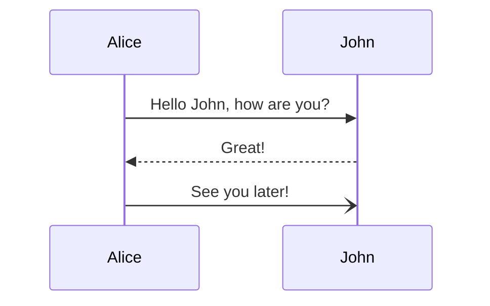

# Markdown-Slides

Generate HTML-Slides with from Markdown-Files

<!-- slide -->

## Features

- ✨ Beautiful slides including a pretty title slide
- 📱 Slides are fully response for mobile devices and small screens
- 🌓 Light and Dark Mode
- 🖨️ Print styles to create PDFs in the browser
- ♿ HTML slides are accessible
- 📖 Table of contents to jump to specific slides
- 💡 Code highlighting with highlight.js
- ➗ Equations with MathJax
- 📈 Diagrams with Mermaid
- #️⃣ Slide numbers will be generated automatically
- 📅 Date of the build will be included as a versioning
- 📚 Supports multiple markdown files to split your presentation in subslides
- ➡️ Use space and arrow keys to navigate
- 🎨 Easily override the Stuttgart Media University (HDM) theme with custom colors and logos
- 🚀 Just deploy your slides with Gitlab or GitHub pages

<!-- slide -->

## Requirements for local builds

If you want to build the slides locally, Node or Docker is required.

### How to use it

Create one (README.md) or more markdown files in the root of your directory (e.g. a git repository) and start typing.

To start a new slide use a comment `<!-- slide -->`.

Example:

```markdown
# Lecture Title

@module[123456]
@semester[Summer 2025]

Korbinian Kuhn [kuhnko@](mailto:kuhnko@hdm-stuttgart.de)

<!-- slide -->

## Content

- What we will do
- What you will learn
```

Build the slides with:

```bash
sh master/build.sh
```

Serve slides (you can also open the index.html file locally, but you might run into CORS issues e.g. for MathJax):

```bash
npx http-server -c-1 public
```

<!-- slide -->

## CLI parameters

Convert current directory to slides into a output directory `public`:

```bash
npx @korbiniankuhn/markdown-slides
```

Whitelist certain files and directories:

```bash
npx @korbiniankuhn/markdown-slides --allowed-files .md images style.css script.js
```

CLI arguments:

| Argument        | Description                                                              | Default   | Required |
| --------------- | ------------------------------------------------------------------------ | --------- | -------- |
| -i, --in        | Input directory                                                          | .         | false    |
| -o, --out       | Output directory                                                         | public    | false    |
| -l, --language  | Language                                                                 | en        | false    |
| --toc-numbering | Add numbering to headlines                                               | true      | false    |
| --allowed-files | Whitelist directories, files,or extensions                               | undefined | false    |
| --ignored-files | Blacklist directories, files or extensions (dotfiles are always ignored) | undefined | false    |

<!-- slide -->

## Markdown extensions

<!-- slide -->

### Slides

| Identifier       | Description        |
| ---------------- | ------------------ |
| `<!-- slide -->` | Starts a new slide |

### Spacer

| Identifier         | Description                 |
| ------------------ | --------------------------- |
| `:spacer`          | Medium vertical spacer      |
| `:spacer{size=sm}` | Small vertical spacer       |
| `:spacer{size=md}` | Medium vertical spacer      |
| `:spacer{size=lg}` | Large vertical spacer       |
| `:spacer{size=xl}` | Extra-Large vertical spacer |

<!-- slide -->

### Layout

| Identifier         | Description            |
| ------------------ | ---------------------- |
| `<!-- row -->`     | Starts a row container |
| `<!-- row:end -->` | Ends a row container   |
| `<!-- col -->`     | Starts a col container |
| `<!-- col:end -->` | Ends a col container   |

#### Example

```markdown
<!-- row -->
<!-- col -->

Left

<!-- col:end -->
<!-- col -->

Right

<!-- col:end -->
<!-- row:end -->
```

<!-- slide -->

### Custom Theme

Look into the [examples/custom-theme](examples/custom-theme) directory to overide the default theme:

Just provide these files in the root of your project:

- logo-light.svg, logo-dark.svg, favicon.svg
- style.css:

```css
:root {
  --color-primary: blue;
}
```

<!-- slide -->

### MathJax

LaTex equations are converted to equations with MathJax, including all accessibility features:

Centered Math (`\\[ ... \\]`):

\\[ x = {-b \pm \sqrt{b^2-4ac} \over 2a} \\]

Inline Math (`\\( ... \\)`):

\\( x = {-b \pm \sqrt{b^2-4ac} \over 2a} \\)

<!-- slide -->

### MermaidJS

Mermaid is supported, fits in nicely with the colors of the theme and automatically reacts to the light or dark mode:


